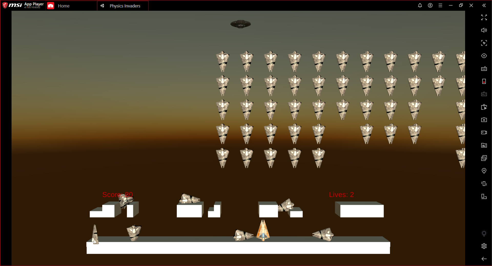

# Physics Invaders README

The best way to play is with an Android emulator! You can download PhysicsInvaders/Android_Build/AndroidPhysicsInvaders.apk

Alternatively, download PhysicsInvaders/Build/PhysicsInvaders.exe

Instructions:

 Press left and right arrows to move left and right

 Space bar to shoot bullets

 Press C to change camera mode
 
 Aliens once shot fall to the ground; clear them to increase your mobility

 Shooting the UFO ship gives you a 5 second power-up of unlimited bullets and invincibility

 Shoot all of the aliens before losing your 3 lives to win!

 

